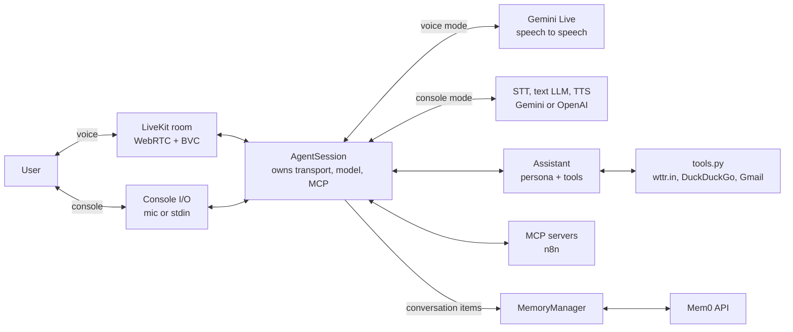
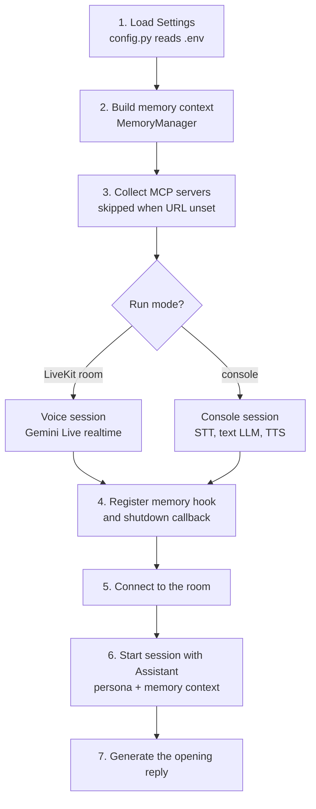
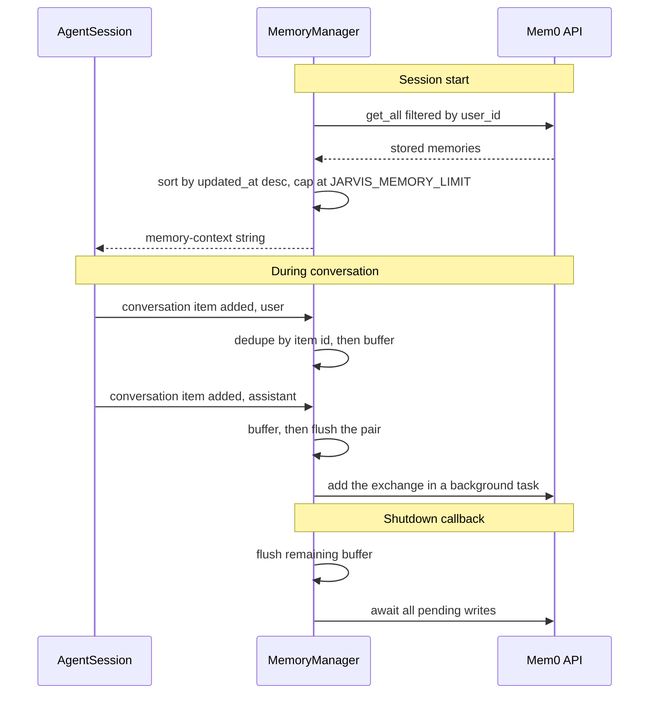

# J.A.R.V.I.S

J.A.R.V.I.S is a voice-first AI personal assistant inspired by the digital assistant from Iron Man. It runs as a **LiveKit Agents** worker: LiveKit handles the low-latency real-time transport, **Google Gemini Live (native audio)** handles speech-in/speech-out in a single model, **Mem0** provides long-term memory across sessions, and function tools plus **MCP** servers give it real-world capabilities.

## Features

- 🗣️ **Real-time voice interaction** — Gemini native-audio Live model (speech-to-speech, no separate STT/TTS hop) for low-latency conversation in a LiveKit room.
- ⌨️ **Console mode** — a separate STT → text LLM → TTS pipeline so the agent is usable from the terminal with typed or mic input.
- 🧠 **Persistent long-term memory** — [Mem0](https://github.com/mem0ai/mem0) stores user/assistant exchanges and replays them as context on the next session.
- 🔧 **Built-in tools** — current weather (`wttr.in`), web search (DuckDuckGo), Gmail SMTP email, and a Mem0 sync diagnostic.
- 🔌 **Extensible via MCP** — external tools (e.g. an n8n MCP server) are loaded natively by LiveKit at session start.
- 🤫 **Noise cancellation** — LiveKit Background Voice Cancellation (BVC) on the room input.
- 👔 **Butler persona** — a classy, mildly sarcastic voice defined entirely in `prompts.py`.

---

## Architecture

### Overview

The whole system is a single Python process — a LiveKit Agents worker. `agent.py` is the only entrypoint; everything else is a focused module it composes at startup. There is no web server, database, or background service of our own: state lives in Mem0, transport lives in LiveKit, and the model lives in Google's API.

At runtime it reads left to right in lanes: the user, the transport, the session, and then the three things the session fans out to — inference, capabilities, and memory. `AgentSession` is the hub; it owns the transport, the model, and the MCP connections, while the `Assistant` it drives owns the persona and the local tools.



Startup is a separate concern — `entrypoint()` composes the modules in a fixed order, and the only branch is the run mode:



### Components

| Module | Responsibility |
| --- | --- |
| `agent.py` | Process entrypoint and wiring. Builds `Settings`, loads memory context, constructs the right `AgentSession` for the run mode, registers the memory hook, connects to the room, and kicks off the opening reply. |
| `config.py` | The only place that reads the environment. Exposes a frozen `Settings` dataclass with typed/validated accessors (`_env_bool`, `_env_float`, `_env_int`) and sane defaults, so no other module calls `os.getenv()`. |
| `prompts.py` | `AGENT_INSTRUCTION` (persona, tool etiquette, how to use memory) and `SESSION_INSTRUCTION` (how to open the conversation). Behaviour changes belong here, not in code. |
| `tools.py` | The `@function_tool` implementations the model can call: `get_weather`, `search_web`, `send_email`, `debug_memory_sync`. All blocking I/O is pushed to threads via `asyncio.to_thread` so the realtime event loop is never stalled. |
| `memory.py` | `MemoryManager` — owns the Mem0 async client, builds the session-start context message, buffers and flushes conversation turns, and drains in-flight writes on shutdown. |
| `scripts/mem0_smoke_test.py` | Manual, live-API check that Mem0 credentials and the user ID actually work. Not part of the agent runtime. |
| `docs/voice-response-diagnostics.md` | Post-mortem notes on the voice-output failure modes that shaped the current startup design. |

### Two session modes

The most important structural decision in the codebase: **the model pipeline differs by run mode**, because Gemini's native-audio Live model cannot complete typed turns.

`agent.py` detects the mode with `ctx.is_fake_job()` (true for `python agent.py console`) and builds one of two sessions:

| | Voice mode (LiveKit room) | Console mode (terminal) |
| --- | --- | --- |
| Builder | `_build_voice_session()` | `_build_console_session()` |
| Pipeline | single speech-to-speech model | STT → text LLM → TTS |
| Model | `google.realtime.RealtimeModel` (`JARVIS_GOOGLE_MODEL`) | `google.LLM` or `openai.LLM`, per `JARVIS_LLM_PROVIDER` |
| STT | — (handled in-model) | `openai.STT()` |
| TTS | — (handled in-model) | `google.beta.GeminiTTS` or `openai.TTS()` |
| VAD | LiveKit room input | `silero.VAD` |
| Memory context | appended to `instructions` | added as a `system` message in `ChatContext` |

That last row matters: Gemini Live rejects system-role history, so memory has to be folded into the instruction string; text LLMs take it as a proper system message.

### Request flow (a single voice turn)

1. The user speaks; audio streams over WebRTC into the LiveKit room, through BVC noise cancellation.
2. `AgentSession` forwards the audio to Gemini Live, which handles transcription, reasoning, and speech synthesis in one model.
3. If the model decides to call a tool, LiveKit dispatches to the matching `@function_tool` in `tools.py` (or to an MCP tool advertised by the n8n server). The tool runs its network I/O in a worker thread and returns a plain string.
4. The model speaks its response back through the room.
5. Each completed user and assistant item fires `conversation_item_added`, which `MemoryManager` records.

### Memory lifecycle



Design details worth knowing:

- **Turns are flushed in pairs.** A user message alone is buffered; the following assistant message triggers the flush. Mem0 extracts much better facts from an exchange than from an isolated line.
- **Dedupe is by chat-item id, not content.** Deduping on content would silently drop legitimate repeats like "yes" or "ok".
- **The injected context is tagged** with the `[memory-context]` prefix so it is recognisable and never written back into memory as if the user had said it.
- **Writes are fire-and-forget but tracked.** Each save is an `asyncio.Task` held in a pending set; `aclose` is registered as a LiveKit shutdown callback and awaits them, so quitting doesn't lose the last exchange.
- **Memory is optional.** If the Mem0 client fails to initialise, `available` is `False`, the hook is never registered, and the agent runs fine without persistence.

### Failure-isolation principles

The architecture deliberately keeps audio startup independent of every optional integration (see `docs/voice-response-diagnostics.md` for the incident that motivated this):

- MCP is skipped with a warning when `N8N_MCP_SERVER_URL` is unset, rather than constructing a server against an empty URL.
- Mem0 failures downgrade to "no memory" instead of aborting the session.
- Tool errors are caught and returned to the model as readable strings, so the assistant can explain the problem out loud instead of going silent.
- Every external call has an explicit timeout (`HTTP_TIMEOUT_SECONDS`, `SMTP_TIMEOUT_SECONDS`) and startup milestones are logged with the selected model and voice.

### Security boundaries

- Secrets live only in `.env`, read only by `config.py`. `.env`, `keys.txt`, and `KMS/` are excluded from version control via `.gitignore`.
- `send_email` treats model output as untrusted: `_clean_header` strips CR/LF to block SMTP header injection, and both `to_email` and `cc_email` are validated before any connection is opened.
- The persona prompt requires verbal confirmation of recipient and subject before an email may be sent.

---

## Prerequisites

- Python 3.10+
- A LiveKit server or LiveKit Cloud project
- Google AI credentials (Gemini)
- A Mem0 API key (optional — the agent runs without it)
- An OpenAI API key (only for console mode STT, or if `JARVIS_LLM_PROVIDER=openai`)
- A Gmail App Password (only for the `send_email` tool)

## Installation

1. Clone this repository.
2. Create and activate a virtual environment:

   ```bash
   python -m venv venv
   venv\Scripts\activate  # macOS/Linux: source venv/bin/activate
   ```

3. Install dependencies:

   ```bash
   pip install -r requirements.txt
   ```

## Configuration

Copy `.env.example` to `.env` and fill it in. Every variable below is read in `config.py`.

| Variable | Default | Purpose |
| --- | --- | --- |
| `JARVIS_GOOGLE_MODEL` | `gemini-2.5-flash-native-audio-preview-12-2025` | Gemini Live model for the voice path |
| `JARVIS_GOOGLE_VOICE` | `Charon` | Voice name for Gemini audio output |
| `JARVIS_TEMPERATURE` | `0.8` | Sampling temperature for both paths |
| `JARVIS_LLM_PROVIDER` | `google` | Console pipeline provider: `google` or `openai` |
| `JARVIS_GOOGLE_TEXT_MODEL` | `gemini-2.5-flash` | Console text LLM when provider is `google` |
| `JARVIS_OPENAI_TEXT_MODEL` | `gpt-4o-mini` | Console text LLM when provider is `openai` |
| `JARVIS_USE_BVC` | `true` | Enable Background Voice Cancellation |
| `JARVIS_VIDEO_ENABLED` | `true` | Accept video tracks on room input |
| `MEM0_USER_ID` | `Saathwik` | Partitions memories per user |
| `MEM0_API_KEY` | — | Mem0 credentials |
| `JARVIS_MEMORY_LIMIT` | `50` | Max memories injected at session start |
| `N8N_MCP_SERVER_URL` | — | MCP server URL; MCP is skipped if unset |
| `GMAIL_USER` / `GMAIL_APP_PASSWORD` | — | Credentials for `send_email` |
| `LIVEKIT_URL` / `LIVEKIT_API_KEY` / `LIVEKIT_API_SECRET` | — | LiveKit connection (or use `lk` CLI defaults) |

## Running the Assistant

Voice mode — register the worker with LiveKit and connect a frontend:

```bash
python agent.py start
```

Console mode — talk to it from the terminal (`Ctrl+T` toggles text/mic):

```bash
python agent.py console
python agent.py console --text   # start in text mode
```

Verify Mem0 connectivity independently:

```bash
python scripts/mem0_smoke_test.py
```

## Extending

- **Add a tool**: write an `async` function in `tools.py` decorated with `@function_tool()`, taking `context: RunContext` first, with a docstring the model reads as the tool description. Then add it to the `tools=[...]` list in `Assistant.__init__`. Keep blocking work inside `asyncio.to_thread`.
- **Add an MCP server**: append another `mcp.MCPServerHTTP(url=...)` to `mcp_servers` in `entrypoint`. Transport (SSE vs streamable HTTP) is auto-detected from the URL.
- **Change behaviour or tone**: edit `prompts.py`.
- **Add a setting**: add the field to `Settings` and populate it in `_load()` — don't call `os.getenv()` elsewhere.

## Security Notice

`.env`, `keys.txt`, and the `KMS/` directory contain sensitive credentials and are excluded from version control via `.gitignore`. Do not commit them.
